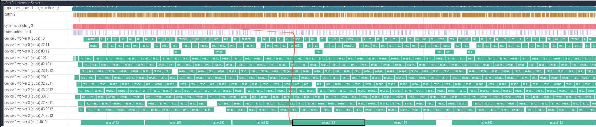

# Perfetto Trace Guide

This guide explains how to generate `batching_trace.json`, understand its
contents, and inspect it with the Perfetto UI. Enable tracing only during
benchmarks or local debugging sessions.

## 1. Enable the JSON trace

Tracing is disabled by default. Enable it in the `batching` section of your
model configuration:

```yaml
batching:
  trace_enabled: true
  trace_file: /tmp/starpu/  # optional custom path
```

- `trace_enabled` flips the instrumentation on as soon as the server starts.
- `trace_file` is optional and must point to a directory; the server writes
  `batching_trace.json` inside. When omitted the server writes the file in the
  working directory. The same directory also receives
  `batching_trace_summary.csv`, a CSV dump of each batch (worker ID and type,
  batch size, request IDs, queue/build/submit/scheduling/codelet/inference/
  callback durations, and total time. Warmup batches are excluded.)
  The server automatically runs `scripts/plot_batch_summary.py` at shutdown to
  produce latency scatter plots (combined, multi-dimension batch-size, CPU-only,
  GPU-only), cumulative + moving average timelines, throughput vs time (falling
  back to batch size when logical job counts are absent), SLA coverage curves
  (cumulative % under 50/100/200 ms), rolling percentile curves (worker-type
  P50/P95/P99), a stacked thermometer (queue->callback), a
  phase vs batch_size heatmap, a worker/phase heatmap, a phase correlation
  heatmap, a queue/codelet/inference pairplot, a CPU/GPU waterfall,
  a phase Pareto chart, latency vs batch size correlations, queue-vs-inference
  backlog scatters (colored by batch size), batch_size distributions, CPU/GPU
  violin plots, latency CDFs (worker type, per-worker grids, and dominant batch
  sizes), worker phase-utilization bars, per-worker boxplots, radar charts, and
  a worker/time heatmap.
  correlation view.

Each server restart truncates the previous file, so copy the trace elsewhere
before launching another run. Stop the server before opening the trace to avoid
an opening error.

## 2. JSON layout

The output follows the Chrome trace-event format.



Key event types:

- `request_enqueued` (track “request enqueued”) records each incoming request.
- `batch` (track “batch”) spans the time requests spend waiting for a dynamic
  batch.
- `batch_build` (track "dynamic batching") covers the time spent assembling the
  batch before it is handed off to StarPU. Flow arrows link these slices to the
  worker that eventually executes the batch.
- `batch_submitted` (track “batch submitted”) is an instant event that ties a
  batch to the worker that will execute it.
- Entries named after correspond to worker lanes.

Warmup requests reuse the same keys with a `warming_` prefix so they can be
filtered out quickly inside Perfetto.

All timestamps are relative microseconds since the trace started.
