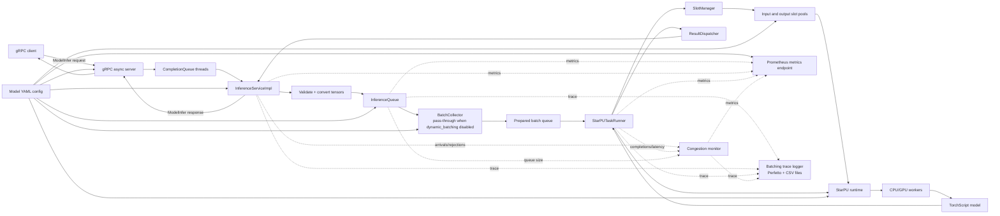

# StarPU Inference Server - Server Guide

|[Installation](./installation.md)|[Quickstart](./quickstart.md)|[Server Configuration](./server_guide.md)|[Client Guide](./client_guide.md)|[Docker Guide](./docker_guide.md)|[Tracing](./tracing.md)|
|---|---|---|---|---|---|

## Server Guide

This guide walks through launching the gRPC inference server and crafting the
YAML configuration files it consumes. It assumes you already followed
[installation](./installation.md) to install dependencies and build the project.

## Architecture overview

At a high level, the async gRPC server receives requests on CompletionQueue
threads, validates and converts tensors, and enqueues jobs for batching (which
can pass through when `dynamic_batching` is disabled). The StarPU task runner
uses slot pools to stage inputs/outputs, submits tasks to StarPU CPU/GPU
workers, and a result dispatcher returns responses. During startup the server
loads the model, initializes StarPU, runs warmup, and only then starts serving.
Metrics are emitted by the gRPC service, queue, and runner and exposed through
the Prometheus endpoint. Batching traces are written by the trace logger to
Perfetto JSON + CSV files.



## 1. Prepare a model configuration

The server loads exactly one TorchScript model per configuration file. The
configuration is written in YAML and must include the following required keys:

|Key|Description|
|---|---|
|`name`|Model configuration identifier.|
|`model`|Absolute or relative path to the TorchScript `.pt`/`.ts` file.|
|`inputs`|Sequence describing each input tensor, every element must define `name`, `data_type`, and `dims`.|
|`outputs`|Sequence describing each output tensor, every element must define `name`, `data_type`, and `dims`.|
|`max_batch_size`|Upper bound for per-request batch size.|
|`batch_coalesce_timeout_ms`|Milliseconds to wait before flushing a dynamic batch.|
|`pool_size`|Number of reusable input/output buffer slots to preallocate.|

Each tensor entry under `inputs` or `outputs` must provide:

- `name`: unique identifier.
- `data_type`: tensor element type. Supported values (see `src/proto/model_config.proto`) are:
  - `TYPE_BOOL`
  - `TYPE_UINT8`, `TYPE_UINT16`, `TYPE_UINT32`, `TYPE_UINT64`
  - `TYPE_INT8`, `TYPE_INT16`, `TYPE_INT32`, `TYPE_INT64`
  - `TYPE_FP16`, `TYPE_FP32`, `TYPE_FP64`
  - `TYPE_BF16`
- `dims`: positive integer dimensions (batch dimension first).

`TYPE_STRING` is defined in the protobuf schema but is not accepted by the
current runtime datatype mapping yet.

Optional keys unlock batching, logging, and runtime controls:

|Key|Description|Default|
|---|---|---|
|`starpu_env`|Lets you pin StarPU-specific environment variables.|unset|
|`model_name`|Model name exposed through gRPC. If omitted, defaults to `name`.|`name`|
|`use_cpu`|Enable CPU workers. Combine with `use_cuda` for heterogeneous (CPU+GPU) execution.|`true`|
|`group_cpu_by_numa`|Spawn one StarPU CPU worker per NUMA node instead of per core.|`false`|
|`use_cuda`|Enable GPU workers. Accepts either `false` or a sequence of mappings such as `[{ device_ids: [0,1] }]`.|`false`|
|`gpu_model_replication`|GPU model replica policy: `per_device` keeps one model instance per CUDA device, `per_worker` creates one instance per StarPU CUDA worker on each configured device.|`per_device`|
|`address`|gRPC listen address (host:port).|`127.0.0.1:50051`|
|`metrics_port`|Port for the Prometheus metrics endpoint.|`9090`|
|`max_message_bytes`|Maximum gRPC message size (bytes) for request/response payloads. If omitted, computed from model I/O and `max_batch_size` (minimum 32 MiB).|`auto (>= 32 MiB)`|
|`max_queue_size`|Maximum number of pending inference requests; additional requests are rejected immediately with `RESOURCE_EXHAUSTED`.|`100`|
|`max_inflight_tasks`|Upper bound on StarPU tasks already submitted (backlog inside StarPU). `0` keeps it unbounded, set a value to apply backpressure before submitting new tasks.|`0`|

Behavior of `use_cpu` and `use_cuda`:

- `use_cpu: true`, `use_cuda: [{ device_ids: [...] }]` → StarPU runs heterogeneously on CPU and GPU workers.
- `use_cuda: false` or omitted → pipeline runs on CPU workers only (unless the CLI overrides the setting).
- `use_cpu: false`, `use_cuda: [{ ... }]` → pipeline runs on GPU workers only.
- Setting `group_cpu_by_numa: true` keeps CPU workers enabled but collapses them to one worker per NUMA node so that each inference shares the full socket instead of a single core.

`gpu_model_replication: per_worker` is useful only when a GPU exposes more than
one StarPU CUDA worker, for example with `STARPU_NWORKER_PER_CUDA > 1`. It can
improve concurrency, but it multiplies TorchScript model memory usage on that
GPU by the number of workers.

When the queue reaches `max_queue_size`, the server refuses new requests
immediately and responds with gRPC `RESOURCE_EXHAUSTED` instead of letting the
queue grow unbounded.

`max_inflight_tasks` caps the number of StarPU tasks already submitted (in
flight). When the limit is reached, batch collection pauses until a task
finishes, preventing unbounded prefetching into StarPU’s internal queues.

Optional keys for warmup, tracing, and debugging:

|Key|Description|Default|
|---|---|---|
|`verbosity`|Log verbosity level. Alias: `verbose`. Supported values: `0`/`silent`, `1`/`info`, `2`/`stats`, `3`/`debug`, `4`/`trace`.|`0`|
|`dynamic_batching`|Enable dynamic batching (`true`/`false`).|`true`|
|`sync`|Run the StarPU worker pool in synchronous mode (`true`/`false`).|`false`|
|`trace_enabled`|Emit batching trace JSON (queueing/assignment/submission/completion events) compatible with the Perfetto UI plus a CSV summary of each batch.|`false`|
|`trace_output`|Directory for the batching Perfetto trace (requires `trace_enabled: true`). When set, the server writes `perfetto_trace.json`, `trace.csv` (worker info, batch size, request IDs, microsecond arrival timestamps, phase timings, warmup batches excluded) and `metrics.csv` (queue size + cumulative rejections over time) there. If unset, it writes `perfetto_trace.json` in the current working directory.|unset|
|`warmup_pregen_inputs`|Number of pre-generated inputs reused during warmup. Set to `0` to skip warmup entirely.|`2`|
|`warmup_request_nb`|Warmup requests per worker before batching scaling.|`2`|
|`warmup_batches_per_worker`|Minimum number of full-sized batches each worker executes during the warmup phase. Combined with `max_batch_size` to derive additional warmup requests.|`1`|
|`seed`|Seed for warmup input RNG and `torch::manual_seed`.|unset|

Traces use the Chrome trace-event JSON format, so you can drag the resulting file into [ui.perfetto.dev](https://ui.perfetto.dev) to inspect batching activity. See the [tracing guide](./tracing.md) for a step-by-step walkthrough of enabling the trace, interpreting the JSON, using Perfetto, and capturing StarPU FXT traces. Enable it only while profiling dynamic batching, for GPU-wide timelines rely on NVIDIA `nsys`.

During startup the server always schedules a short warmup before accepting real
traffic. The final number of warmup requests per worker is the maximum between
`warmup_request_nb` and `warmup_batches_per_worker * max_batch_size`, ensuring
each worker executes at least the configured number of full batches to warm its
caches and kernels. Set `warmup_pregen_inputs: 0` to skip warmup entirely.

### gRPC metadata endpoints

The server exposes lightweight introspection endpoints derived from the YAML
config so clients can self-discover model shapes and batching limits:

- `ServerMetadata`: returns server name/version. The `extensions` field is
  currently returned empty.
- `ModelMetadata`: returns model name, versions (if provided), and I/O tensor
  names, dtypes, and shapes.
- `ModelConfig`: returns a `ModelConfig` message with `max_batch_size` and the
  configured input/output schema.
- `ModelStatistics`: returns in-memory counters and latency aggregates for
  requests seen by the server.

Example queries with grpcurl (uses server reflection when available):

```bash
grpcurl -plaintext 127.0.0.1:50051 inference.GRPCInferenceService/ServerMetadata
grpcurl -plaintext -d '{"name":"bert_local"}' 127.0.0.1:50051 \
  inference.GRPCInferenceService/ModelMetadata
grpcurl -plaintext -d '{"name":"bert_local"}' 127.0.0.1:50051 \
  inference.GRPCInferenceService/ModelConfig
grpcurl -plaintext -d '{"name":"bert_local"}' 127.0.0.1:50051 \
  inference.GRPCInferenceService/ModelStatistics
```

### StarPU environment overrides

The `starpu_env` block lets you pin StarPU-specific environment variables inside
the YAML instead of exporting them in the shell. Each entry is copied into the
process environment before StarPU initialises, so it has the same effect as
`STARPU_*=value ./starpu_server ...`.

```yaml
starpu_env:
  STARPU_SCHED: "lws"
  STARPU_FXT_TRACE: "1"
  STARPU_CUDA_THREAD_PER_WORKER: "1"
  STARPU_CUDA_PIPELINE: "4"
  STARPU_NWORKER_PER_CUDA: "4"
  STARPU_WORKERS_GETBIND: "0"
```

- `STARPU_SCHED`: choose the StarPU scheduler policy (e.g., `eager`, `lws`,
  `heft`). Defaults to `lws` when not set in the YAML or environment.
- `STARPU_FXT_TRACE`: enable StarPU FXT tracing (set to `1`) to produce StarPU
  timeline files, combine with `STARPU_FXT_PREFIX` to control the output
  directory.
- `STARPU_CUDA_THREAD_PER_WORKER`: number of CPU helper threads created per CUDA
  worker. A value of `1` keeps one submission thread per StarPU GPU worker.
- `STARPU_CUDA_PIPELINE`: depth of the CUDA pipeline, i.e., the number of
  asynchronous stages StarPU can queue concurrently on each worker.
- `STARPU_NWORKER_PER_CUDA`: number of StarPU workers spawned for each physical
  CUDA device, higher values allow more concurrent CUDA streams per GPU.
- `STARPU_WORKERS_GETBIND`: when set to `0`, disables StarPU’s attempt to query
  and enforce CPU affinities while initialising workers (can help when bindings
  are managed externally).

### Congestion detection

The server exposes a congestion detector. It smooths
queue/fill signals and raises a `congestion_flag` metric before the queue
overflows. Tune it with the `congestion` block in the YAML.
See [congestion doc](./congestion_detection.md) for details on the
detector, yaml configuration fields, and examples.

## 3. Example: `models/bert.yml`

The repository ships a ready-to-run configuration:

```yaml
name: bert_local
starpu_env:
  STARPU_SCHED: lws
model: ../models/bert_libtorch.pt
inputs:
  - { name: "input_ids", data_type: "TYPE_INT64", dims: [1, 128] }
  - { name: "attention_mask", data_type: "TYPE_INT64", dims: [1, 128] }
outputs:
  - { name: "output0", data_type: "TYPE_FP32", dims: [1, 128, 768] }
verbosity: 4
address: 127.0.0.1:50051
metrics_port: 9090
max_batch_size: 32
max_queue_size: 100
max_inflight_tasks: 256
batch_coalesce_timeout_ms: 1000
dynamic_batching: true
sync: false
use_cpu: true
group_cpu_by_numa: true
use_cuda:
  - { device_ids: [0] }
gpu_model_replication: per_worker
pool_size: 12
```

Pick a distinct `name` for each deployment (e.g., `bert_local`, `bert_prod`) so
logs and metrics identify which configuration is running.

Update `model:` to match the absolute path of your TorchScript model and adjust
the tensor shapes to the sequence length and hidden size exported by your
training pipeline. **The sample assumes batches of size 1 and lets the runtime expand
to `max_batch_size`.**

## 4. Launch the inference server

Once the configuration YAML is ready and the server binaries are built:

```bash
./starpu_server --config path/to/config.yml
```
