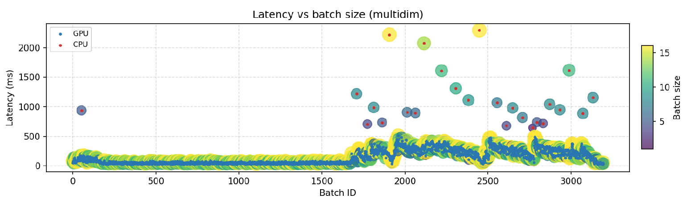
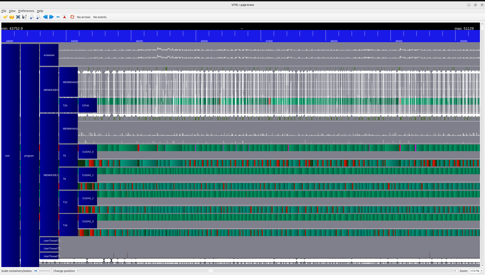

# Tracing Guide (Perfetto & StarPU FXT)

| [Installation](./installation.md) | [Quickstart](./quickstart.md) | [Server Configuration](./server_guide.md) | [Client Guide](./client_guide.md) | [Docker Guide](./docker_guide.md) | [Tracing](./tracing.md) |
| --- | --- | --- | --- | --- | --- |

This guide explains how to produce and read the batching JSON trace (Perfetto),
generate batch summary plots, and capture StarPU FXT traces. Enable tracing only
for profiling or debugging sessions.

## 1. Batching JSON trace (enable + read)

Enable the batching trace in your YAML and inspect the Chrome trace-event JSON
with Perfetto:

```yaml
batching:
  trace_enabled: true
  trace_output: /tmp/  # optional custom path
```

- `trace_enabled` flips instrumentation on as soon as the server starts.
- `trace_output` must point to a directory, the server writes
  `batching_trace.json` there. The same directory also receives
  `batching_trace_summary.csv` (one line per batch). Warmup batches are
  excluded. The server runs `scripts/plot_batch_summary.py` at shutdown to
  produce plots.

Each restart truncates the previous JSON, so copy it elsewhere before relaunch.
Stop the server before opening the file.

Drag the JSON into [ui.perfetto.dev](https://ui.perfetto.dev) and look for these
event types:

- `request_enqueued` records each incoming request.
- `batch` spans the time requests spend waiting for a dynamic batch.
- `batch_build` covers the time spent assembling the batch before handing it off
  to StarPU, flow arrows link to the worker that executes the batch.
- `batch_submitted` ties a batch to the worker that will execute it.
- Tracks named after workers correspond to worker lanes.

Warmup requests reuse the same keys with a `warming_` prefix so they can be
filtered out quickly inside Perfetto.


## 2. Batch summary plots

The server writes `batching_trace_summary.csv` alongside the JSON trace and
automatically runs `scripts/plot_batch_summary.py` at shutdown to generate
latency scatter plots for CPU/GPU batches. Run it manually to re-plot or to
point at archived traces:

```bash
python3 /scripts/plot_batch_summary.py /path/to/batching_trace_summary.csv --output batching_plots.png
```



## 3. StarPU FXT traces (YAML + viewing)

Enable FXT directly in your config via `starpu_env` (or export the variables in
the shell):

```yaml
starpu_env:
  STARPU_FXT_TRACE: "1"
  STARPU_FXT_PREFIX: "/tmp/starpu_traces"
```

Then launch the serve.
This produces `prof_<pid>` files under the chosen prefix. Convert them to a
Paje timeline and open with Vite:

```bash
cd /tmp/starpu_traces
starpu_fxt_tool -i prof_<pid>
vite paje.trace  # To open it, use https://solverstack.gitlabpages.inria.fr/vite/
```



FXT traces expose low-level StarPU scheduling and CUDA runtime activity.
